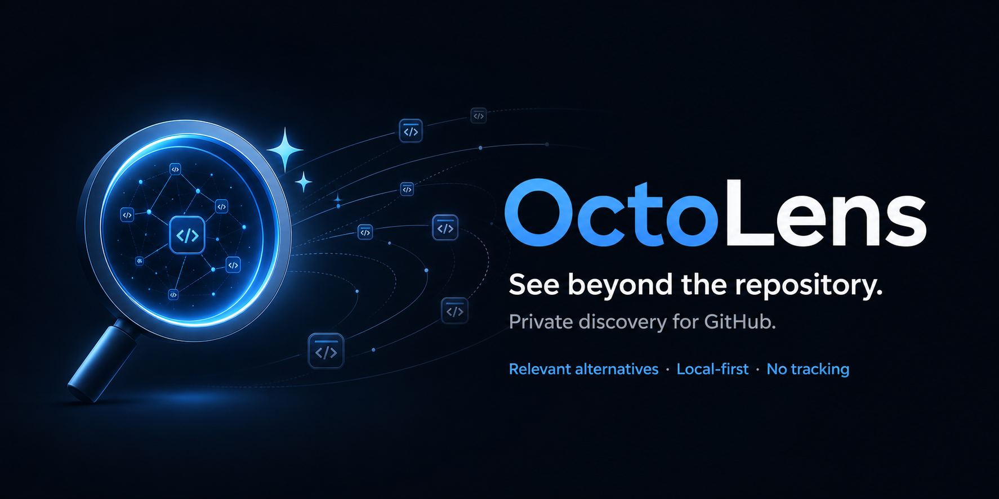
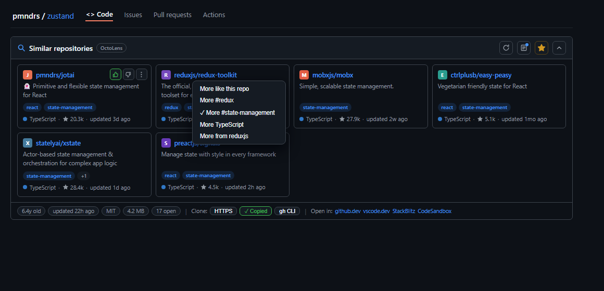
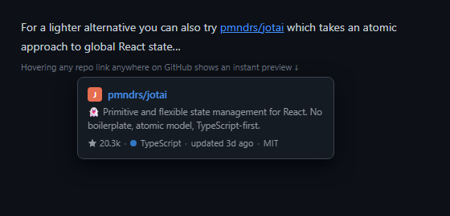
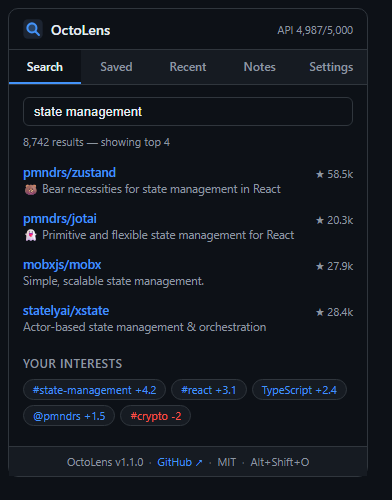

<p align="center">
  
</p>

<p align="center">
  <a href="https://github.com/dataswarmproject/octolens/releases/latest"></a>
  <a href="LICENSE"></a>
  
  
  
</p>

<h3 align="center">See beyond the repository.</h3>

<p align="center">
  OctoLens is a private discovery layer for GitHub: find relevant alternatives,<br>
  preview repositories in place, and shape recommendations around what matters to you.
</p>

<p align="center"><strong>Explore wider. Decide faster. Keep your signal yours.</strong></p>

<p align="center">
  <a href="#installation">Install</a> ·
  <a href="#product-tour">Product tour</a> ·
  <a href="#how-recommendations-work">How it works</a> ·
  <a href="PRIVACY.md">Privacy</a> ·
  <a href="#development">Build with us</a>
</p>

---

## Why OctoLens

GitHub is excellent at showing you what is inside a repository. It is much less helpful when you need to understand the repository's neighborhood: credible alternatives, adjacent tools, and projects that better match your preferences.

OctoLens adds that missing layer directly to repository pages—without introducing an account, a hosted profile, or a tracking backend.

| Discover | Evaluate | Remember |
|---|---|---|
| Find related repositories by topic, language, and repository context. | Compare activity, license, size, popularity, and maintenance signals without leaving the page. | Save repositories, attach private notes, and teach the ranking what you want to see more—or less—of. |

## Product tour

### A native-feeling discovery strip

OctoLens sits below the repository navigation and follows GitHub's light or dark theme. Recommendations explain their relevance through shared topic tags.

<p align="center">
  
</p>

### Context without tab overload

| Preview any repository link | Search and manage your private library |
|:---:|:---:|
|  |  |

## Installation

OctoLens has no build step and no runtime dependencies.

### From a release

1. Download and extract the archive from the [latest release](https://github.com/dataswarmproject/octolens/releases/latest).
2. Open your browser's extensions page:
   - Chrome: `chrome://extensions`
   - Edge: `edge://extensions`
   - Brave: `brave://extensions`
3. Enable **Developer mode**.
4. Select **Load unpacked** and choose the extracted folder containing `manifest.json`.

### From source

```bash
git clone https://github.com/dataswarmproject/octolens.git
cd octolens
```

Load the cloned folder with the same browser steps above.

### Your first minute

1. Open a public GitHub repository such as [pmndrs/zustand](https://github.com/pmndrs/zustand).
2. Review the similar-repository cards below the repo navigation.
3. Like a useful result, hide a poor match, or choose **More of…** to shape the ranking.
4. Open the OctoLens toolbar popup to search, review saved repos, manage notes, or change settings.

> If the GitHub tab was already open when you installed or reloaded OctoLens, refresh it once so the content script can attach.

## What you can do

| Capability | What it gives you |
|---|---|
| **Similar repositories** | Context-aware alternatives ranked by relevance before popularity, with generic topics filtered out. |
| **Personalized ranking** | Explicit controls for like, hide, topic, language, and author preferences, plus lightweight signals from clicks and bookmarks. |
| **Repository hovercards** | Description, stars, language, last push, and license when you hover a repository link that GitHub does not already decorate. |
| **Quick repository intelligence** | Age, last push, license, size, open issues and pull requests, plus an archived warning. |
| **Clone and editor shortcuts** | Copy HTTPS, SSH, or GitHub CLI clone commands; open in github.dev, vscode.dev, StackBlitz, or CodeSandbox. |
| **Private workspace** | Local bookmarks, recently viewed repositories, and notes attached to any repository. |
| **Search from anywhere** | Search public GitHub repositories from the toolbar popup without leaving the current tab. |
| **Portable local data** | Export or import your library, notes, history, interests, and feature settings as a local JSON backup. Tokens and API caches are excluded. |

Every major feature can be enabled or disabled under **OctoLens → Settings**. Use `Alt+Shift+O` to collapse or expand the strip.

## The local-first promise

OctoLens is designed so the useful profile it learns remains under your control.

| Data | Where it lives | Leaves the browser? | Included in backup? |
|---|---|:---:|:---:|
| Bookmarks, notes, history, interests | `chrome.storage.local` | No | Yes |
| Feature settings | `chrome.storage.local` | No | Yes |
| Optional GitHub token | `chrome.storage.local` | Only to authenticate direct GitHub API requests | **No** |
| Repository metadata and search cache | `chrome.storage.local` / session storage | Fetched from GitHub | **No** |

- No OctoLens account, analytics pipeline, or application backend.
- Repository queries go directly to `api.github.com`; repository avatars may load from GitHub's image CDN.
- The optional token is used only in the `Authorization` header sent to GitHub.
- Personalization weights are capped, inspectable, removable, and resettable.
- Hovercards protect the remaining unauthenticated API budget when it becomes low.

Read the complete [OctoLens Privacy Policy](PRIVACY.md).

### Optional GitHub token

Public GitHub API access works without a token, but a token provides a larger request allowance.

1. Create a [fine-grained personal access token](https://github.com/settings/tokens) using the least privilege needed for public repository access.
2. Open **OctoLens → Settings**.
3. Paste the token and select **Save**.

OctoLens validates the token with GitHub before saving it. Remove the value and save again to return to unauthenticated access.

### Back up or move your data

Open **OctoLens → Settings → Backup & restore**:

- **Export data** downloads a readable, versioned JSON file.
- **Import data** validates an OctoLens backup, asks for confirmation, and replaces bookmarks, history, notes, interests, and feature settings.
- Your existing GitHub token remains unchanged during import.
- Files over 1 MB, unknown schema versions, unsafe repository identifiers, and malformed data are rejected.

## How recommendations work

```text
current repository
      │
      ├── metadata: topics, language, name, description
      │
      ▼
specific topics first ── generic discovery tags removed
      │
      ▼
up to two GitHub Search queries
      │
      ▼
raw candidate pool cached for 12 hours
      │
      ▼
relevance score + optional local preference score
      │
      ▼
six recommendations, re-ranked instantly after feedback
```

The base relevance score favors shared topics, then language alignment, then star count on a logarithmic scale. Popularity can break ties between relevant peers, but it cannot overpower topical fit.

The cached candidate pool remains unpersonalized. OctoLens applies your local preference profile at render time, so likes, hides, and **More of…** choices take effect without another API request.

## Development

### Requirements

- A Chromium browser with Manifest V3 support
- Node.js 18 or newer for the test harness
- No package installation

### Workflow

1. Edit the source files.
2. Open the browser's extensions page and select **Reload** on OctoLens.
3. Refresh the GitHub tab you are testing.
4. Run the offline suite before opening a pull request.

| Command | Purpose |
|---|---|
| `node scripts/test-sw.mjs` | Run 37 deterministic service-worker checks with a mocked GitHub API. |
| `node scripts/test-sw.mjs --live` | Run the offline suite plus real GitHub API round trips. |
| `node --check src/background/service-worker.js` | Check service-worker syntax. |
| `node --check src/content/content.js` | Check content-script syntax. |
| `node --check src/popup/popup.js` | Check popup syntax. |

The test harness executes the real service worker inside a Node VM with a mocked `chrome.*` surface. It covers query construction, ranking, caching, request coalescing, rate limits, error paths, personalization, notes, and privacy-safe data portability.

### Manual quality check

Before submitting a UI change, verify:

- Classic and React-based GitHub repository layouts
- GitHub light and dark themes
- Soft navigation between repositories
- Keyboard focus and the `Alt+Shift+O` shortcut
- Popup empty, loading, success, and error states
- No new console errors

## Architecture

```text
manifest.json
├── src/background/service-worker.js  GitHub API, cache, ranking, local data
├── src/content/content.js             GitHub integration and interaction logic
├── src/content/content.css            Theme-aware injected interface
├── src/popup/popup.html               Search, library, notes, settings
├── src/popup/popup.js                 Popup behavior and backup workflow
├── src/popup/popup.css                Popup visual system
├── scripts/test-sw.mjs                Dependency-free service-worker harness
├── icons/                             Extension icons, 16–512 px
└── assets/                            Logo, banner, and product screenshots
```

### Design decisions

- **Zero runtime dependencies:** the unpacked source is the extension.
- **Ephemeral-safe worker:** durable state lives in browser storage, never in service-worker memory.
- **Bounded storage:** cache, history, bookmarks, notes, and imported preference maps have explicit limits.
- **Safe rendering:** external text is rendered through DOM text nodes rather than HTML injection.
- **GitHub-native presentation:** injected UI uses GitHub's Primer variables and follows the active theme.
- **Navigation resilient:** Turbo events, soft-navigation events, history changes, and a debounced observer keep the panel mounted without duplicate injection.

## Contributing

Issues and pull requests are welcome. The most useful contributions improve relevance, accessibility, browser compatibility, language coverage, or user control without weakening the local-first model.

1. Fork the repository and create a focused branch.
2. Keep the extension dependency-free unless a dependency has a compelling, documented reason.
3. Add or update tests for behavior changes.
4. Run the offline suite and relevant syntax checks.
5. Describe the user impact, verification performed, and any trade-offs in the pull request.

Good first contributions include new **Open in…** targets, language colors, topic extraction for repositories without tags, translations, and accessibility improvements.

By contributing, you agree to license your work under this project's license and grant the maintainers the right to offer it under alternative commercial license terms. This preserves the project's dual-licensing option.

## Brand system

OctoLens should feel observant, useful, and quiet—not noisy or intrusive.

| Element | Guidance |
|---|---|
| **Name** | Always write **OctoLens** with a capital O and L. |
| **Product promise** | **See beyond the repository.** |
| **Supporting line** | **Explore wider. Decide faster. Keep your signal yours.** |
| **Voice** | Precise, curious, developer-first, and privacy-literate. Avoid hype and surveillance language. |
| **Symbol** | The lens represents inspection; the spark represents discovery beyond the current frame. |
| **Core palette** | Lens Blue `#4493F8`, Spark Blue `#79C0FF`, GitHub Dark `#0D1117`, Slate `#1C2431`. |

Use [assets/logo.svg](assets/logo.svg) for scalable brand applications, [assets/banner.png](assets/banner.png) for repository and launch surfaces, and the generated PNG icons under `icons/` for browser-extension packaging.

## Roadmap

- [x] Local JSON backup and restore
- [ ] Star-history sparkline on repository cards
- [ ] Optional encrypted sync using a user-controlled destination
- [ ] Firefox support
- [ ] Chrome Web Store listing
- [ ] Optional community layer, separated from the private local-first core

## License

**[AGPL-3.0](LICENSE)** © DataSwarm Project.

You may use, study, modify, and share OctoLens under the terms of the AGPL. If you distribute a modified version—or run it as part of a network service—the corresponding source must remain available under the same license.

For proprietary embedding without AGPL obligations, contact the maintainer about a separate commercial license.
